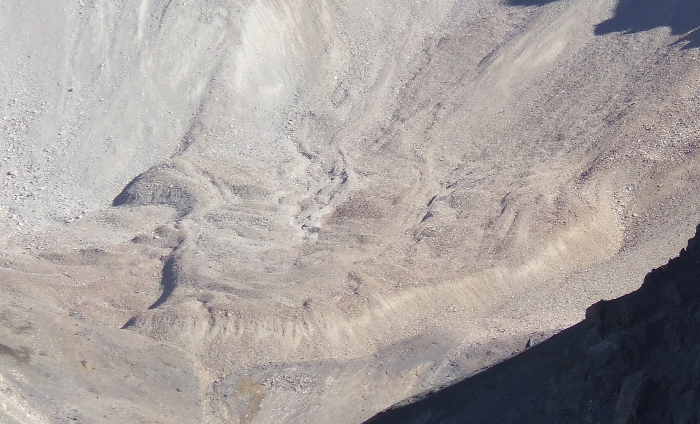
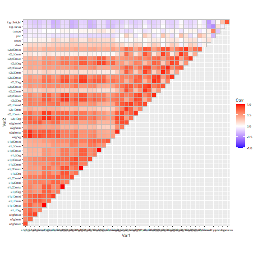
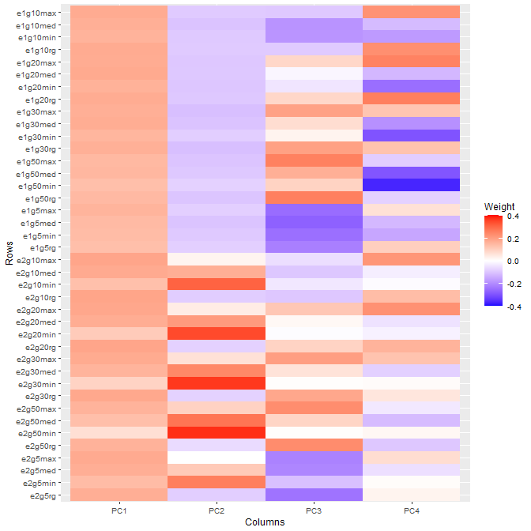
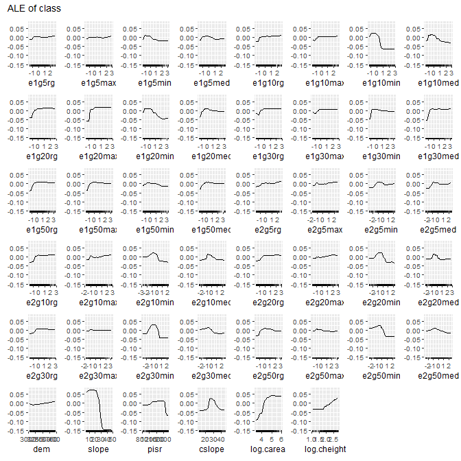
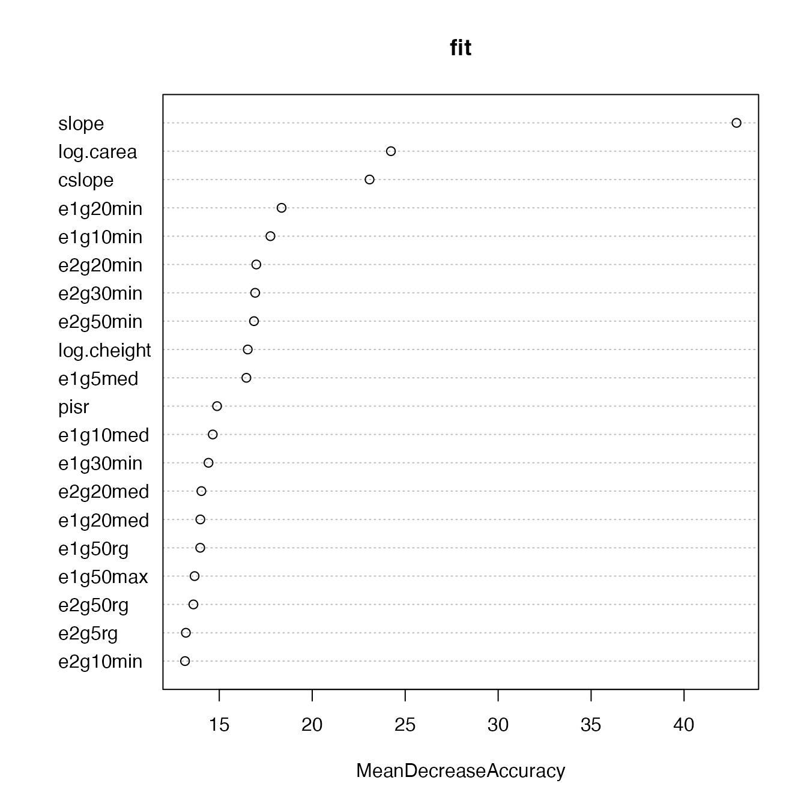
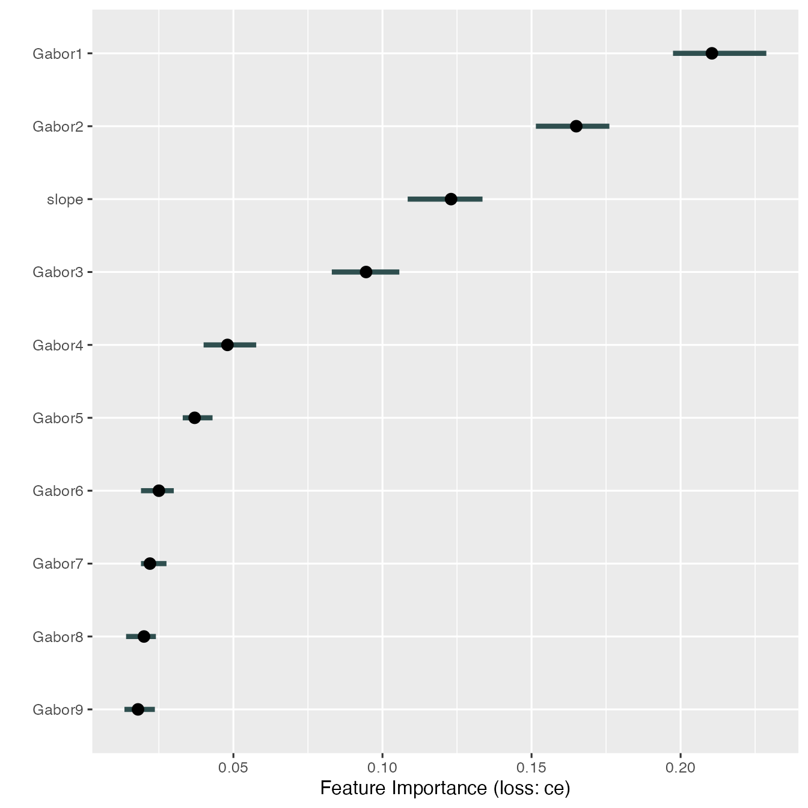
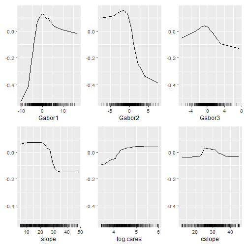
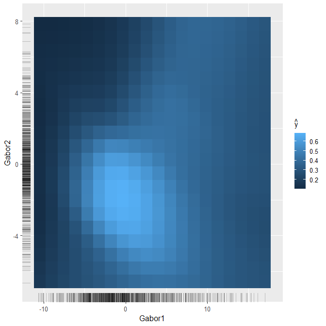

The `wiml` Package: Transforming Feature Space to Interpret Machine
Learning Models
================
Alexander Brenning
First published 12 Apr 2021, last edited 11 Apr 2021

## Preface

This vignette walks you through the analyses performed for the paper
that introduces the novel model interpretation approach implemented in
the `wiml` package. Please refer to that paper for conceptual and formal
details, and cite it when using `wiml` or referring to the methods and
results presented herein.

> Brenning (2021) Transforming Feature Space to Interpret Machine
> Learning Models. arXiv:submit/3691062, submitted 9 Apr 2021.

The `wiml` package serves as a thin wrapper around packages implementing
ALE plots, partial dependence plots and other post-hoc model-agnostic
interpretation tools. In this vignette, I will use `iml`; creating a
vignette for use with `DALEX` is on my to-do list.

For an introduction to interpretable machine learning, see (Molnar
2019), and for a broader overview, (Murdoch et al. 2019). We are
specifically dealing with the situation of post-hoc model-agnostic
dataset-level tools for the interpretation of black-box machine-learning
models. Several of the following steps are computationally expensive and
will be slow even on a workstation since the `iml` package, which does
all the heavy lifting, does not seem to make full use of the parallel
*workers* offered to it, at least not at the time of writing this
document.

## Getting started

### Work environment

Make sure that all required packages and their dependencies are
installed and up-to-date. `wiml` is currently only available via Github,
so you will have to use `devtools` to install it; I also recommend using
the most recent development version of `iml`.

In addition, you will need the packages `stringr`, `purrr`,
`ggcorrplot`, `ggfortify`.
<!--- Packages for parallelization are optional: `future`, `future.callr`. To parallelize computations, you can (optionally) use the following call, specifying the number of workers appropriate for your computing environment:


```r
#library("future")
#library("future.callr")
#future::plan("callr", workers = 4)
#set.seed(444)
#options(future.rng.onMisuse = "ignore")
```

-->

### Case study and data preparation

Land cover classification is a standard task in remote sensing, which
often uses a large set of features (20 ≤ *p* ≤ 200) - for example,
multitemporal spectral reflectances and derived vegetation indices and
texture attributes, or even hyperspectral features. Many of these
features are strongly correlated with each other, and they are often
semantically grouped.

We will look at a rather challenging case study on the detection of rock
glaciers in the Chilean Andes using the random forest classifier and a
combination of 40 texture features and 6 terrain attributes. This is how
a rock glacier looks like - it resembles a lava stream more than a
glacier:

<div class="figure" style="text-align: center">


<p class="caption">
A rock glacier in the Andes of Santiago, Chile. (c) A. Brenning, CC
BY-SA 4.0.
</p>

</div>

The texture features were generated by applying Gabor filters with
varying bandwidth, anisotropy and aggregation settings to an IKONOS
satellite image, resulting in strongly correlated features. This case
study is described in more detail by (Brenning, Long, and Fieguth 2012).
We use a sample of 1000 points from this data set’s Laguna Negra area
(500 presence and 500 absence locations).

Let’s get started by preparing the data set, which is shipped with the
`wiml` package:

``` r
data(gabor, package = "wiml")
d <- gabor[gabor$area == "LN", ]
colnames(d) <- gsub("m30", "", colnames(d))

sel <- c(sample(which(d$class == "FALSE"), size = 500),
         sample(which(d$class == "TRUE"), size = 500))
d <- d[sel,]

# Set up lists of features and model formulas:
gabor_vars <- stringr::str_subset(colnames(d), "e[12]g[1-5]")
terrain_vars <- c("dem", "slope", "pisr", 
                  "cslope", "log.carea", "log.cheight")
yvar <- "class"
Xvars <- c(gabor_vars, terrain_vars)

# Formula for fitting the model with all features:
fo <- as.formula(paste(yvar, "~", 
                       paste(Xvars, collapse = " + ")))

# Trim the tails of distributions to remove outliers:
d[, Xvars] <- d[, Xvars] %>% 
  purrr::map(DescTools::Winsorize, probs = c(0.02, 0.98)) %>%
  as.data.frame()
# Scale only Gabor features:
d[, gabor_vars] <- scale(d[, gabor_vars])
```

### Exploratory analysis

(Impatient readers: please skip this section.)

To show you how strongly the features are correlated, let’s take a look
at this correlation matrix; note that the terrain attribute are the six
features at the top:

``` r
ggcorrplot::ggcorrplot(cor(d[, Xvars]), type = "upper") +
  ggplot2::theme_grey(base_size = 8)
```



To wrap our head around the information contained in the texture
features, we take a look at a principal components analysis (PCA) - the
following plot shows the weights of the (standardized) texture features
in the first four principal components, which explain about 85% of the
variance:

``` r
library("ggfortify")
ggplot2::autoplot(prcomp(d[, gabor_vars])$rotation[,1:4]) +
  scale_fill_gradient2(low = "blue", high = "red", mid = "white", 
   midpoint = 0, limit = c(-.4,.4), space = "Lab", 
   name="Weight") +
  ggplot2::theme_grey(base_size = 9)
```



## Post-hoc interpretation, the traditional way

Before we apply the feature space transformation I propose in the paper,
let’s start with a traditional post-hoc interpretation at the level of
the original features. We will train a random forest model on our 46
features, and create accumulated local effects (ALE) plots as our
preferred way of visualizing the main effects of features in our
black-box model (Molnar 2019):

``` r
fit <- randomForest::randomForest(formula = fo, data = d, importance = TRUE)
```

``` r
simple_predictor <- Predictor$new(fit, data = d, y = yvar, 
                                  type = "prob", class = "TRUE")
simple_effs <- FeatureEffects$new(simple_predictor, 
                                  features = Xvars, 
                                  method = "ale")
```

Well that took some time… here’s finally our figure:

``` r
plot(simple_effs, ncols = 8)
#> Warning: UNRELIABLE VALUE: Future ('future_lapply-1') unexpectedly
#> generated random numbers without specifying argument 'future.seed'.
#> There is a risk that those random numbers are not statistically
#> sound and the overall results might be invalid. To fix this, specify
#> 'future.seed=TRUE'. This ensures that proper, parallel-safe random
#> numbers are produced via the L'Ecuyer-CMRG method. To disable this
#> check, use 'future.seed=NULL', or set option 'future.rng.onMisuse' to
#> "ignore".
```



Can you find a pattern? You’re probably totally lost because you don’t
know what the texture feature names mean; but trust me, it doesn’t get
much better if you know their meanings. How about showing this figure to
a conference audience? Better don’t try…

The same thing happens if we look at permutation-based variable
importances, which are also problematic due to the strong correlations.
We’ll take a quick look using `randomForest`’s built-in method:

``` r
randomForest::varImpPlot(fit, n.var = 20, type = 1)
```



## Model interpretation in transformed feature space

Now you may remember that many of the texture features are strongly
correlated, and according to our domain knowledge, they are semantically
related to each other as the features correspond to isotropic or
anisotropic Gabor filters, wavelengths from 5 to 50 m, and four
different aggregation schemes. We’d really like to think about
decomposing their variance into… principal components!

The relationships between the texture features are in fact reasonably
close to linear, and principal component analysis (PCA) is therefore an
obvious choice for feature engineering. We may be tempted to retrain our
model using the principal components (PCs) instead of the original
features. Nevertheless, there are two reasons why I’m going down that
road:

1.  Feature engineering, and PCA in particular, does not always improve
    model performance; it may in fact be harmful. (Spoiler: It’s not
    harmful in this case study.)
2.  More importantly, in post-hoc analyses, we are not normally able or
    allowed to retrain the model. The whole point of post-hoc methods is
    that they can be applied to trained models.

But how can we examine our model’s behaviour from a PCA perspective
without retraining the model?

Here’s the trick: We’ll use an invertible transformation function as a
pair of glasses that’ll allow us to inspect the model’s behaviour. The
transformation function we’ll be using is a principal component
transformation.

I’ll briefly outline the mathematical formalism, in case you’re
interested. We’re dealing with a model
*f̂* : **x** ∈ ℝ<sup>*p*</sup> ↦ *f̂*(**x**) ∈ ℝ
that was fitted to a training sample *L* in the (original,
untransformed) *p*-dimensional feature space *X* ⊂ ℝ<sup>*p*</sup>,
where the predicted values are probabilities or logits, in the case of
classifiers. We’ll use an invertible transformation function
**T** : *X* → *W* ⊂ ℝ<sup>*p*</sup>,  **w** = **T**(**x**)
that re-expresses the features in our dataset in a way that makes sense
to us as domain scientists. PCA seems reasonable here, but other
transformations can be considered (some thoughts on this in the paper).

The composition of the back transformation **T**<sup> − 1</sup> and the
trained model function *f̂* now formally defines a model *ĝ* on *W*,
*ĝ* := *f̂* ∘ **T**<sup> − 1</sup>
which predicts the real-valued response based on ‘data’ in *W* although
it was trained using a learning sample *L* ⊂ *X* in the untransformed
feature space. So **T**<sup> − 1</sup> is the ‘thin layer’ I was talking
about - a set of glasses, or maybe in this case we should call it a
‘macroscope’ as we’re aggregating information into principal components.
The function *ĝ* behaves exactly like a model trained on **T**(*L*),
both mathematically and computationally, and therefore we can fool any
interpretation tool or R package by applying them to *ĝ* instead of *f̂*.

Note that the PCs are linearly independent, and therefore we also
overcome the issue we had with permutation variable importances
calculated from strongly correlated features.

Before we continue, there’s still one pitfall to avoid: If we apply PCA
to all features, we will ‘mix’ information from the texture and terrain
features, although they are weakly correlated and semantically
completely different. We will therefore use a transformation that does
PCA on the texture features, and nothing (i.e. an identity
transformation) on the terrain attributes. (This is achieved by creating
a rotation matrix that is composed of two block matrices.)

By the way, `wiml` also allows us to perform (truely) structured PCAs,
i.e. seperate PCAs on subsets of features. This would be useful here if
the terrain attributes were strongly correlated, which is not the case.

## Interpretation using structured PCA

So let’s define a structured transformation function **T** that
PCA-transforms the 40 texture feature, but leaves the terrain attributes
untouched.

The `wiml` package refers to transformation functions as *warpers*, just
because it sounds cool.

``` r
# List for structured PCA:
wrp <- pca_warper(d, xvars = gabor_vars, yvar = yvar, 
                  uvars = terrain_vars, wvars = "Gabor")
```

This is an object of class `warper`, which in this case is built around
a `prcomp` object. Its `plot` method provides some insights into the PCA
- we’ve seen enough of that in the exploratory analysis.

So now we’ve got our transformation function **T**, which can be applied
to a dataset by using the `warp` method, and whose inverse is given by
the inverse of its rotation matrix and implemented in the `unwarp`
method.

We now have to wrap our transformation around the trained model,
i.e. create the composition *f̂* ∘ **T**<sup> − 1</sup>:

``` r
wfit <- warp_fitted_model(fit, warper = wrp)
```

This doesn’t really ‘do’ anything - it simply creates an object of class
`warped_model`, which is equipped with a `predict` method. This method
accepts inputs in transformed feature space, i.e. texture PCs and
(unchanged) terrain attributes, and then feeds our trained model `fit`
(or *f̂*) with back tranformed features in the original feature space.
Let’s try that out:

### Permutation variable importance

As you can see, our small sample of four points actually consisted of PC
data (features `Gabor1` etc.), and `wfit` behaves like a model that was
fitted on PC-transformed data.

This means that we’re ready to fool *any* model-agnostic interpretation
tool - just don’t tell’em that ‘wfit’ is not a real model!

### Permutation variable importance

We’ll start with the permutation variable importance:

``` r
imp_wpredictor <- Predictor$new(wfit, 
                                data = warp(d, warper = wrp), 
                                y = yvar, type = "response")
imp <- FeatureImp$new(imp_wpredictor, 
                      loss = "ce", compare = "difference", 
                      n.repetitions = 50)
```

I’ll spare you this messy plot, let’s focus on the top 10 features (At
the time of writing this document, the `features` argument was only
available in the development version of `iml`):

``` r
imp10 <- FeatureImp$new(imp_wpredictor, 
                      loss = "ce", compare = "difference",
                      features = imp$results$feature[1:10],
                      n.repetitions = 50)
```

``` r
ggplot2::theme_set(theme_grey(base_size = 12)) # back to normal
plot(imp10)
```



So, the first two principal components of Gabor texture features *are*
indeed important. `Gabor1` is essentially the mean value across all
texture features - an overall measure of stripedness - which underlines
that we’re doing the right thing when applying Gabor filters. This, and
the information we gain from PCs \#2 and \#3, weren’t visible at all in
the original variable importance plot above.

Also note that permutation on the untransformed feature resulting in a
lot of extrapolation beyond the data-supported region due to the strong
correlations between features. This is not the case here any more - the
PCs are uncorrelated!

### Main effects: ALE plots

Next, we want to display **accumulated local effects (ALE) plots** as
our preferred way of visualizing main effects of features in our
black-box model ((Molnar 2019)):

``` r
top3_terrain_vars <- stringr::str_subset(
  imp$results$feature, "Gabor", negate = TRUE)[1:3]
wfeatures <- c("Gabor1", "Gabor2", "Gabor3",
               top3_terrain_vars)
```

``` r
wpredictor <- Predictor$new(
  wfit, data = warp(d, warper = wrp),
  y = yvar, type = "prob", class = "TRUE"
)
weffs <- FeatureEffects$new(wpredictor, features = wfeatures)
```

``` r
plot(weffs)
#> Warning: UNRELIABLE VALUE: Future ('future_lapply-1') unexpectedly
#> generated random numbers without specifying argument 'future.seed'.
#> There is a risk that those random numbers are not statistically
#> sound and the overall results might be invalid. To fix this, specify
#> 'future.seed=TRUE'. This ensures that proper, parallel-safe random
#> numbers are produced via the L'Ecuyer-CMRG method. To disable this
#> check, use 'future.seed=NULL', or set option 'future.rng.onMisuse' to
#> "ignore".
```



This is much tidier than the 46 ALE plots shown earlier, and domain
experts are perfectly able to explain this to an educated audience.

What about interactions? In untransformed feature space, it would be
absolutely impossible to look at all the *p* \* (*p* − 1)/2 pairwise
interactions; now we essentially

We can also look at interactions between

``` r
weffs_2d_pdp <- FeatureEffect$new(
    wpredictor, feature = c("Gabor1", "Gabor2"),
    method = "pdp", grid.size = c(20, 20))
```

``` r
plot(weffs_2d_pdp)
```



### References

<div id="refs" class="references csl-bib-body hanging-indent">

<div id="ref-brenning.et.al.2021.wiml" class="csl-entry">

Brenning, A. 2021. “Wiml: Transforming Feature Space to Interpret
Machine Learning Models.” *arXiv Preprint*, arXiv:submit/3691062,
submitted 9 Apr 2021.

</div>

<div id="ref-brenning.et.al.2012.gabor" class="csl-entry">

Brenning, A., S. Long, and P. Fieguth. 2012. “Detecting Rock Glacier
Flow Structures Using Gabor Filters and IKONOS Imagery.” *Remote Sensing
of Environment* 125: 227–37.
<https://doi.org/10.1016/j.rse.2012.07.005>.

</div>

<div id="ref-molnar.2019.iml.book" class="csl-entry">

Molnar, C. 2019. *Interpretable Machine Learning: A Guide for Making
Black Box Models Explainable*.

</div>

<div id="ref-murdoch.et.al.2019.iml" class="csl-entry">

Murdoch, W. J., C. Singh, K. Kumbier, R. Abbasi-Asl, and B. Yu. 2019.
“Definitions, Methods, and Applications in Interpretable Machine
Learning.” *Proceedings of the National Academy of Sciences* 116 (44):
22071–80. <https://doi.org/10.1073/pnas.1900654116>.

</div>

</div>


