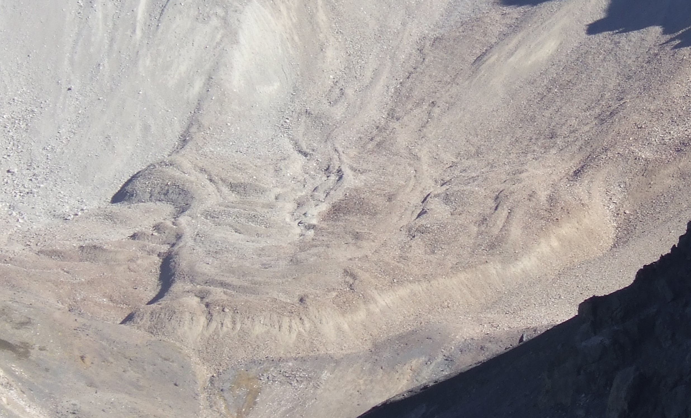
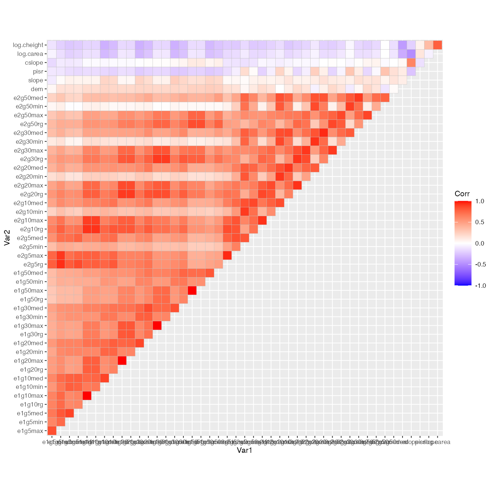
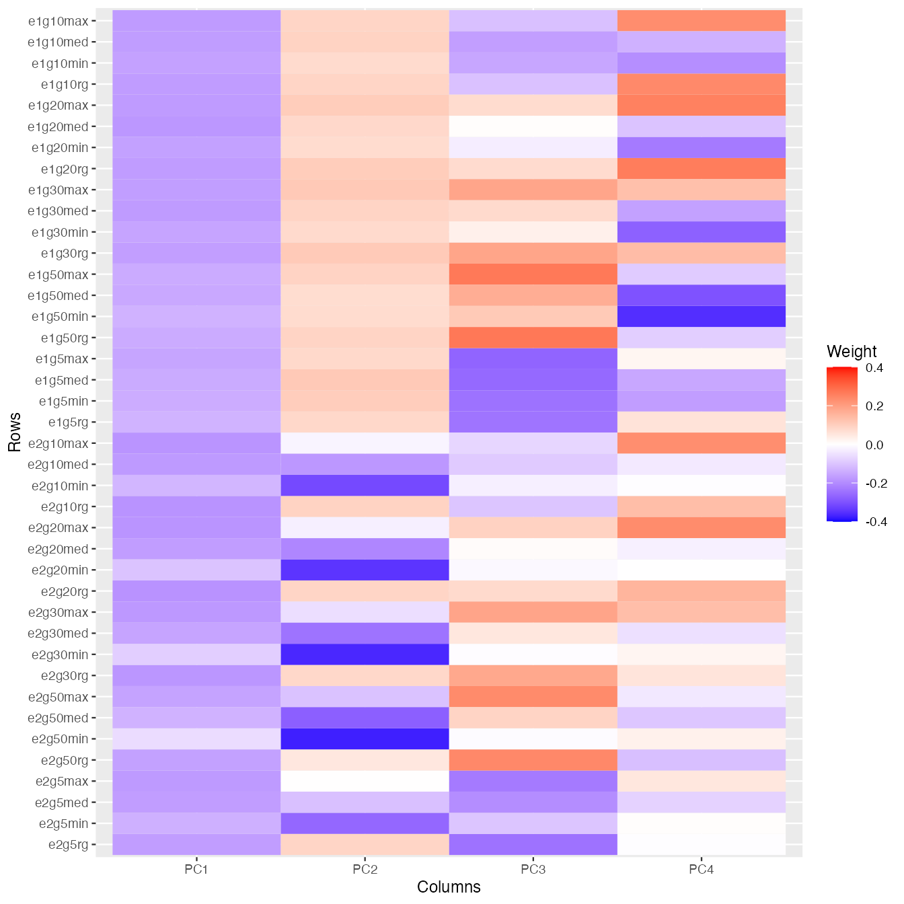
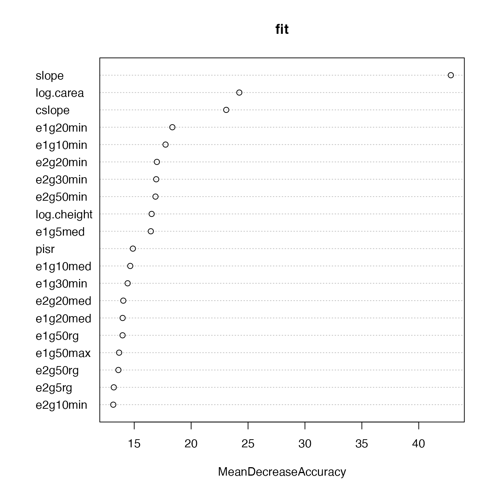

## Preface

This vignette walks you through the analyses performed for the paper that introduces the novel model interpretation approach implemented in the `wiml` package. Please refer to that paper for conceptual and formal details, and cite it when using `wiml` or referring to the methods and results presented herein.

> @brenning.et.al.2021.wiml  Transforming Feature Space to Interpret Machine Learning Models. arXiv:submit/3691062, submitted 9 Apr 2021.

The `wiml` package serves as a thin wrapper around packages implementing ALE plots, partial dependence plots and other post-hoc model-agnostic interpretation tools. In this vignette, I will use `iml`; creating a vignette for use with `DALEX` is on my to-do list.

For an introduction to interpretable machine learning, see [@molnar.2019.iml.book], and for a broader overview, [@murdoch.et.al.2019.iml].  We are specifically dealing with the situation of post-hoc model-agnostic dataset-level tools for the interpretation of black-box machine-learning models. 
Several of the following steps are computationally expensive and will be slow even on a workstation since the `iml` package, which does all the heavy lifting, does not seem to make full use of the parallel *workers* offered to it, at least not at the time of writing this document.

## Getting started

### Work environment

Make sure that all required packages and their dependencies are installed and up-to-date. `wiml` is currently only available via Github, so you will have to use `devtools` to install it; I also recommend using the most recent development version of `iml`.


In addition, you will need the packages `stringr`, `purrr`, `ggcorrplot`, `ggfortify`. Packages for parallelization are optional: `future`, `future.callr`. To parallelize computations, you can (optionally) use the following call, specifying the number of workers appropriate for your computing environment:


```r
library("future")
library("future.callr")
future::plan("callr", workers = 20)
set.seed(444)
options(future.rng.onMisuse = "ignore")
# otherwise ALE plots will throw warnings...
```


### Case study and data preparation

Land cover classification is a standard task in remote sensing, which often uses a large set of features ($20\le p\le200$) - for example, multitemporal spectral reflectances and derived vegetation indices and texture attributes, or even hyperspectral features. Many of these features are strongly correlated with each other, and they are often semantically grouped.

We will look at a rather challenging case study on the detection of rock glaciers in the Chilean Andes using the random forest classifier and a combination of 40 texture features and 6 terrain attributes. This is how a rock glacier looks like - it resembles a lava stream more than a glacier:



The texture features were generated by applying Gabor filters with varying bandwidth, anisotropy and aggregation settings to an IKONOS satellite image, resulting in strongly correlated features. This case study is described in more detail by [@brenning.et.al.2012.gabor]. We use a sample of 1000 points from this data set's Laguna Negra area (500 presence and 500 absence locations).

Let's get started by preparing the data set, which is shipped with the `wiml` package:


```r
data(gabor, package = "wiml")
d <- gabor[gabor$area == "LN", ]
colnames(d) <- gsub("m30", "", colnames(d))

sel <- c(sample(which(d$class == "FALSE"), size = 500),
         sample(which(d$class == "TRUE"), size = 500))
d <- d[sel,]

# Set up lists of features and model formulas:
gabor_vars <- stringr::str_subset(colnames(d), "e[12]g[1-5]")
terrain_vars <- c("dem", "slope", "pisr", 
                  "cslope", "log.carea", "log.cheight")
yvar <- "class"
Xvars <- c(gabor_vars, terrain_vars)

# Formula for fitting the model with all features:
fo <- as.formula(paste(yvar, "~", 
                       paste(Xvars, collapse = " + ")))

# Trim the tails of distributions to remove outliers:
d[, Xvars] <- d[, Xvars] %>% 
  purrr::map(DescTools::Winsorize, probs = c(0.02, 0.98)) %>%
  as.data.frame()
# Scale only Gabor features:
d[, gabor_vars] <- scale(d[, gabor_vars])
```


### Exploratory analysis

(Impatient readers: please skip this section.)

To show you how strongly the features are correlated, let's take a look at this correlation matrix; note that the terrain attribute are the six features at the top: 


```r
ggcorrplot::ggcorrplot(cor(d[, Xvars]), type = "upper") +
  ggplot2::theme_grey(base_size = 8)
```




To wrap our head around the information contained in the texture features, we take a look at a principal components analysis (PCA) - the following plot shows the weights of the (standardized) texture features in the first four principal components, which explain about 85% of the variance:


```r
library("ggfortify")
ggplot2::autoplot(prcomp(d[, gabor_vars])$rotation[,1:4]) +
  scale_fill_gradient2(low = "blue", high = "red", mid = "white", 
   midpoint = 0, limit = c(-.4,.4), space = "Lab", 
   name="Weight") +
  ggplot2::theme_grey(base_size = 9)
```




## Post-hoc interpretation, the traditional way

Before we apply the feature space transformation I propose in the paper, let's start with a traditional post-hoc interpretation at the level of the original features. We will train a random forest model on our 46 features, and create accumulated local effects (ALE) plots as our preferred way of visualizing the main effects of features in our black-box model [@molnar.2019.iml.book]:


```r
fit <- randomForest::randomForest(formula = fo, data = d, importance = TRUE)
```


```r
randomForest::varImpPlot(fit, n.var = 20, type = 1)
```



## Model interpretation in transformed feature space

Now you may remember that many of the texture features are strongly correlated, and according to our domain knowledge, they are semantically related to each other as the features correspond to isotropic or anisotropic Gabor filters, wavelengths from 5 to 50 m, and four different aggregation schemes. We'd really like to think about decomposing their variance into... principal components!

The relationships between the texture features are in fact reasonably close to linear, and principal component analysis (PCA) is therefore an obvious choice for feature engineering. We may be tempted to retrain our model using the principal components (PCs) instead of the original features. Nevertheless, there are two reasons why I'm going down that road:

1. Feature engineering, and PCA in particular, does not always improve model performance; it may in fact be harmful. (Spoiler: It's not harmful in this case study.)
2. More importantly, in post-hoc analyses, we are not normally able or allowed to retrain the model. The whole point of post-hoc methods is that they can be applied to trained models.

But how can we examine our model's behaviour from a PCA perspective without retraining the model?

Here's the trick: We'll use an invertible transformation function as a pair of glasses that'll allow us to inspect the model's behaviour. The transformation function we'll be using is a principal component transformation.

I'll briefly outline the mathematical formalism, in case you're interested. We're dealing with a model 
$$\hat{f}:\mathbf{x}\in\mathbb{R}^p\mapsto\hat{f}(\mathbf{x})\in\mathbb{R}$$ 
that was fitted to a training sample $L$ in the (original, untransformed) $p$-dimensional feature space $X\subset\mathbb{R}^p$, where the predicted values are probabilities or logits, in the case of classifiers. We'll use an invertible transformation function
$$
\mathbf{T}: X \rightarrow W\subset\mathbb{R}^p,\quad \mathbf{w} = \mathbf{T}(\mathbf{x})
$$
that re-expresses the features in our dataset in a way that makes sense to us as domain scientists. PCA seems reasonable here, but other transformations can be considered (some thoughts on this in the paper).

The composition of the back transformation $\mathbf{T}^{-1}$ and the trained model function $\hat{f}$ now formally defines a model $\hat{g}$ on $W$,
$$
\hat{g} := \hat{f}\circ\mathbf{T}^{-1}
$$
which predicts the real-valued response based on 'data' in $W$ although it was trained using a learning sample $L\subset X$ in the untransformed feature space. So $\mathbf{T}^{-1}$ is the 'thin layer' I was talking about - a set of glasses, or maybe in this case we should call it a 'macroscope' as we're aggregating information into principal components. The function $\hat{g}$ behaves exactly like a model trained on $\mathbf{T}(L)$, both mathematically and computationally, and therefore we can fool any interpretation tool or R package by applying them to $\hat{g}$ instead of $\hat{f}$.

Note that the PCs are linearly independent, and therefore we also overcome the issue we had with permutation variable importances calculated from strongly correlated features.

Before we continue, there's still one pitfall to avoid: If we apply PCA to all features, we will 'mix' information from the texture and terrain features, although they are weakly correlated and semantically completely different. We will therefore use a transformation that does PCA on the texture features, and nothing (i.e. an identity transformation) on the terrain attributes. (This is achieved by creating a rotation matrix that is composed of two block matrices.)

By the way, `wiml` also allows us to perform (truely) structured PCAs, i.e. seperate PCAs on subsets of features. This would be useful here if the terrain attributes were strongly correlated, which is not the case.


### References

<div id="refs"></div>
